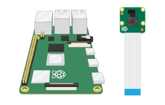

# Nutribuddy-CameraModule

Instructions:
1.	Ensure the VNC option in your raspberrypi is turned ON.
2.	Set up a new connection to the VNC server with the IP address of your network to add your Raspberrypi.
3.	Add all the programs to the Pi and make sure to connect the hardware components in the respective GPIO pins and ports.
4.	Install the required libraries using the pip command from the terminal.
5.	Run the programs using Thonny IDE.
